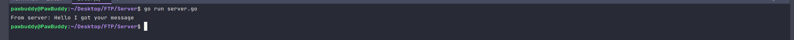
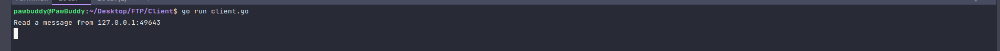

## ⭐ Running the project

The following are the requirements:-

- firstly, verify if go sdk is installed in your machine or not by using the command `go version`.
- Clone the repository and open 2 instances of the terminal.
- One terminal should route to the **Client** directory while the other to the **Server** directory.
- Run `go run client.go` and `go run server.go`.

## 💥 Output

Server Side :-

Client Side :-

